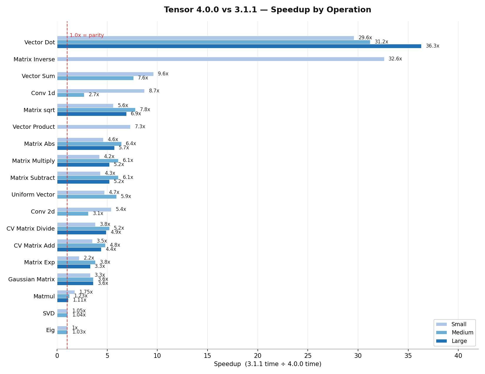

# Performance: 3.1.1 → 4.0.0

Benchmark comparison of the Tensor extension between release **3.1.1** and **4.0.0-rc3**. Each row lists the three measured dataset sizes — **small / medium / large** — followed by the observed speedup, computed as _3.1.1 ÷ 4.0.0_. A value below 1.0x indicates a regression.

Some operations were benchmarked on fewer than three sizes. Where an operation was only measured at one or two sizes, only those values are shown. Note that each benchmark measures only a single operation - the benefit of the contiguous C buffer is realized increasingly over chains of multiple operations. That speedup is not measured in these particular benchmarks.

## Results

| Operation | 3.1.1 | 4.0.0-rc3 | Speedup |
| --- | --- | --- | --- |
| Column Vector Matrix Add | 19.0 / 288.46 / 1207.17 ms | 5.45 / 60.36 / 272.35 ms | 3.5x / 4.8x / 4.4x |
| Column Vector Matrix Divide | 20.46 / 314.53 / 1320.18 ms | 5.46 / 60.05 / 270.81 ms | 3.8x / 5.2x / 4.9x |
| Matrix Matrix Multiply | 24.23 / 384.81 / 1512.42 ms | 5.71 / 63.62 / 288.62 ms | 4.2x / 6.1x / 5.2x |
| Matrix Matrix Subtract | 24.02 / 386.6 / 1502.53 ms | 5.65 / 63.90 / 288.62 ms | 4.3x / 6.1x / 5.2x |
| Matrix Fill | 0.052 / 0.161 / 0.434 ms | 5.11 / 70.74 / 262.9 ms | 0.01x / 0.00x / 0.00x |
| Gaussian Matrix | 108.907 / 1310.55 / 5131.92 ms | 32.99 / 366.72 / 1427.14 ms | 3.3x / 3.6x / 3.6x |
| Uniform Vector | 104.56 / 1287.73 ms | 22.12 / 216.99 ms | 4.7x / 5.9x |
| Matmul | 0.07 / 2.66 / 19.5 s | 0.04 / 2.17 / 17.62 s | 1.75x / 1.23x / 1.11x |
| Vector Dot | 17.48 / 298.95 / 1203.4 ms | 0.59 / 9.57 / 33.2 ms | 29.6x / 31.2x / 36.3x |
| Matrix Inverse | 3.91 s | 0.12 s | 32.6x |
| Eig | 0.94 / 0.74 s | 0.95 / 0.72 s | 1.0x / 1.03x |
| SVD | 0.44 / 25.36 s | 0.42 / 24.48 s | 1.05x / 1.04x |
| Vector Sum | 2.77 / 43.93 ms | 0.29 / 5.76 ms | 9.6x / 7.6x |
| Vector Product | 2.76 ms | 0.38 ms | 7.3x |
| Conv 1d | 25.58 / 14.96 ms | 2.93 / 5.52 ms | 8.7x / 2.7x |
| Conv 2d | 30.87 / 10.76 ms | 5.77 / 3.5 ms | 5.4x / 3.1x |
| Matrix Flatten | 19.63 / 310.58 / 1241.25 ms | 0.005 / 0.007 / 0.005 ms | 3926x / 44369x / 248250x |
| Matrix Abs | 25.37 / 388.31 / 1560.48 ms | 5.49 / 60.91 / 273.71 ms | 4.6x / 6.4x / 5.7x |
| Matrix sqrt | 31.3 / 479.84 / 1947.15 ms | 5.63 / 61.91 / 283.25 ms | 5.6x / 7.8x / 6.9x |
| Matrix Exp | 28.66 / 440.60 / 1765.33 ms | 13.2 / 116.51 / 536.88 ms | 2.2x / 3.8x / 3.3x |

All values are wall-clock milliseconds (or seconds where noted) of the single measured run.

## Visual Summary

The chart omits two table entries to keep the linear axis legible: `Matrix Flatten` (3,926x–248,250x, far beyond the axis) and `Matrix Fill` (a regression, discussed below).

## Gains by cause

**Contiguous C buffer replacing PHP arrays.** The core change in 4.0.0 is that tensor data is now backed by a single contiguous C `Buffer` instead of a PHP array. This removes the per-element indirection and copy-on-read that dominated 3.1.1, and it accounts for the broad 3–8x wins across matrix arithmetic — `Matrix Multiply` (4.2x–6.1x), `Matrix Subtract` (4.3x–6.1x), and the Column Vector matrix operations (3.5x–5.2x). It is most dramatic in the structural `Matrix Flatten` op, which was measured at 3,926x faster at the small size up to ~248,000x at the large size once array materialization was eliminated.

**AVX / AVX2 / AVX512 SIMD kernels with dynamic dispatch.** Element-wise and unary operations are now routed to hand-vectorized kernels dispatched on CPU architecture. This drives the unary wins — `Matrix Abs` (4.6x–6.4x), `Matrix sqrt` (5.6x–7.8x), `Matrix Exp` (2.2x–3.8x) — and the reductions that reduce over the buffer, `Vector Sum` (9.6x / 7.6x) and `Vector Product` (7.3x).

**Tiled FMA convolution kernels.** Convolutions now use tiled kernels with fused multiply-add and vectorization, giving `Conv 1d` 8.7x / 2.7x and `Conv 2d` 5.4x / 3.1x gains.

**Factory random-number path.** Random generation improved roughly 3–6x: `Gaussian` (3.3x–3.6x) and `Uniform Vector` (4.7x / 5.9x).

**BLAS-bound operations (little headroom left).** Operations already routed to native OpenBLAS / LAPACKE in 3.1.1 improved only modestly, as expected: `Matmul` (1.1x–1.75x), `Eig` (~1.0x, effectively flat), and `SVD` (1.04x–1.05x).

**One-off wins.** `Matrix Inverse` (32.6x) and `Vector Dot` (up to 36.3x) improved by an order of magnitude or more, consistent with the removal of PHP-array intermediates in the reduction path.

## Regression

One operation is measured as slower in 4.0.0-rc3: **`Matrix Fill`**, roughly two orders of magnitude slower at every size (`0.052 ms` → `5.11 ms` at the small size; `0.434 ms` → `262.9 ms` at the large size). This is the only operation in the table that regressed and is flagged as a candidate for investigation before the final 4.0.0 release.

## Methodology

Benchmarks were produced from the phpbench suites under `benchmarks/` via `composer benchmark`. Operations are run at **small / medium / large** dataset sizes; a subset was measured at fewer than three sizes and is reported accordingly. The 4.0.0 column reflects the `4.0.0-rc3` build. The speedup column is computed as 3.1.1 ÷ 4.0.0 for each size.
